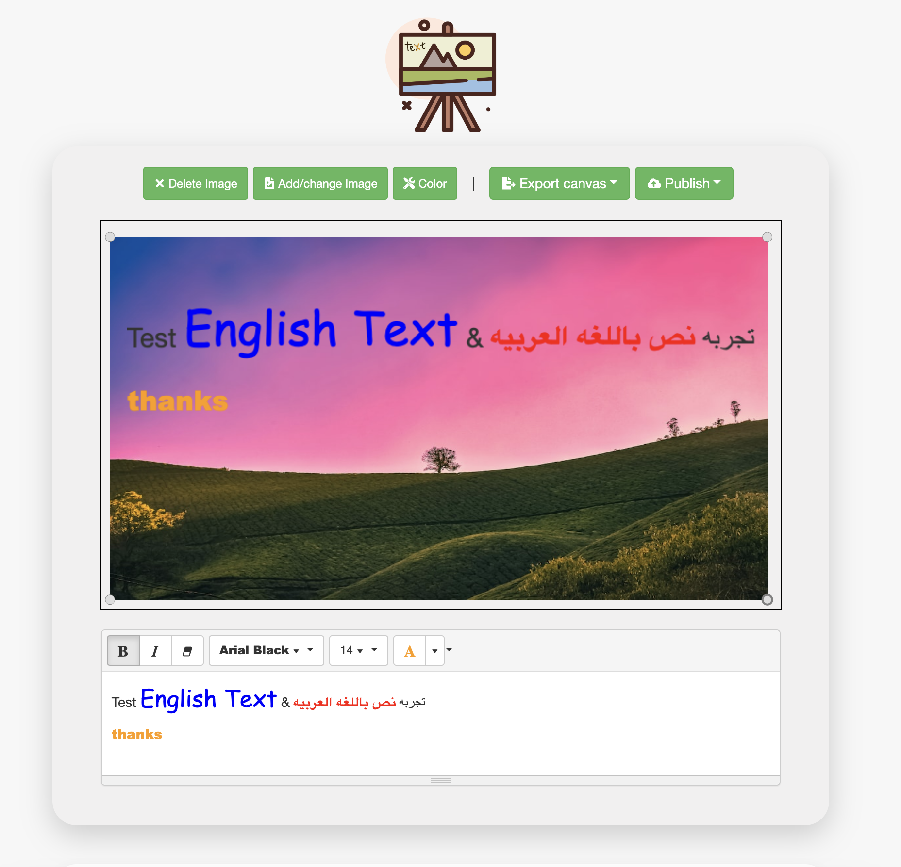
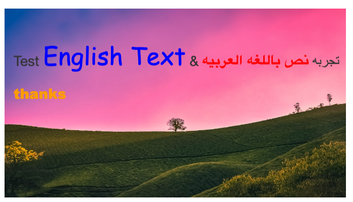

## Canvas Signage
##### _Canvas manipulation of given resizable uploaded image and text editor multi-styled text in PHP and React._

Editor:  

Export: 

[NinjoShop.com](https://ninjoshop.com)

[Demo video  🎥](https://youtu.be/g79jXwKfW4U)

[Get Source Code](https://buy.stripe.com/cN2cNlekr140alO9AA) for $39

## Features

- Drag and Drop file
- Free transform image
- Render and display multi-styled text
- Movable image and text
- Text editor supports multi-languages
  - en-US
  - ar-AR
  - fr-FR
  - zh-CN
  - etc...
- Text editor add/remove configurable toolbar styles
  - Insert (picture, link, ...)
  - Font Style (fontname, color, forecolor, ...)
  - Paragraph style (style, ol, ul, ...)
  - Misc (fullscreen, codeview, undo, ...)
- Export canvas in multi-formats (png/jpeg/webp)
- Publish canvas on cloud with unique urls
- Clean source code
- Support RTL
- Configurable background color

## Stack & Tools
- PHP 8
- Laravel 8
- JavaScript
- React.js 18
- Bootstrap 4
- jQuery
- MariaDB 10.5.6
- Composer
- NPM
- Axios
- Laravel Mix
- GD for image processing
- phpMyAdmin
- Docker
- docker-compose
- HTTPS/SSL

